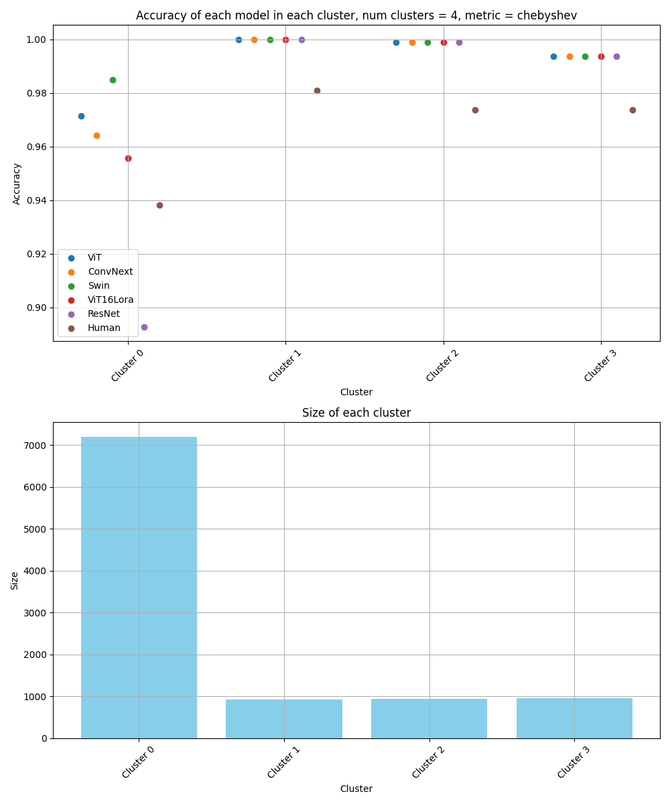
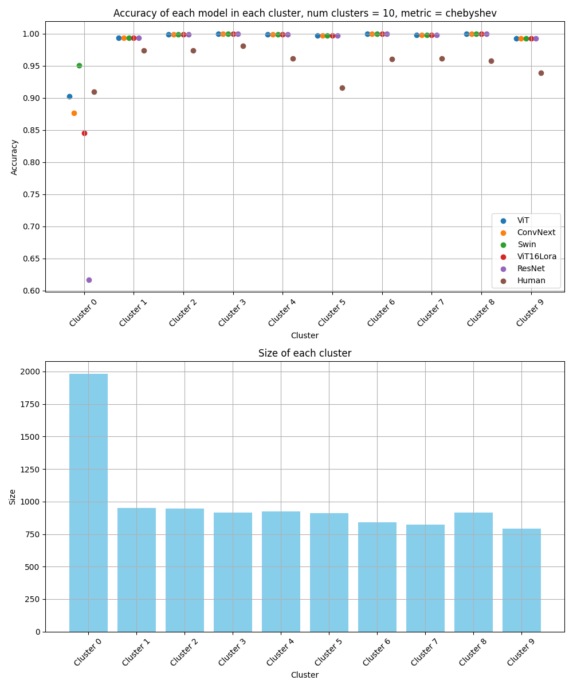
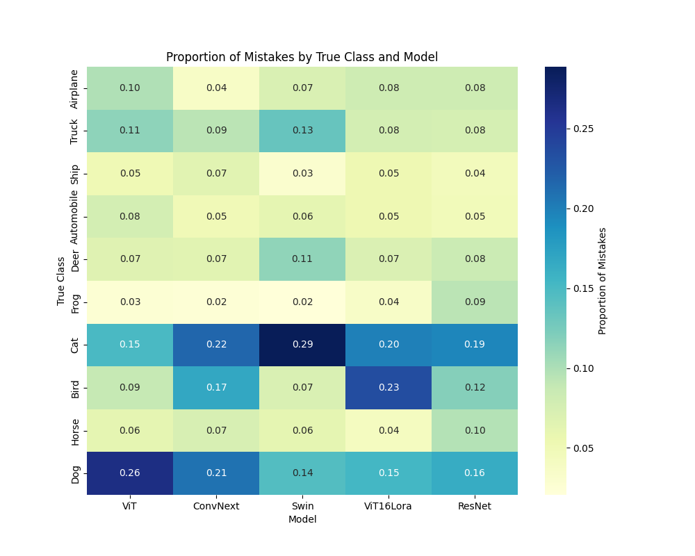
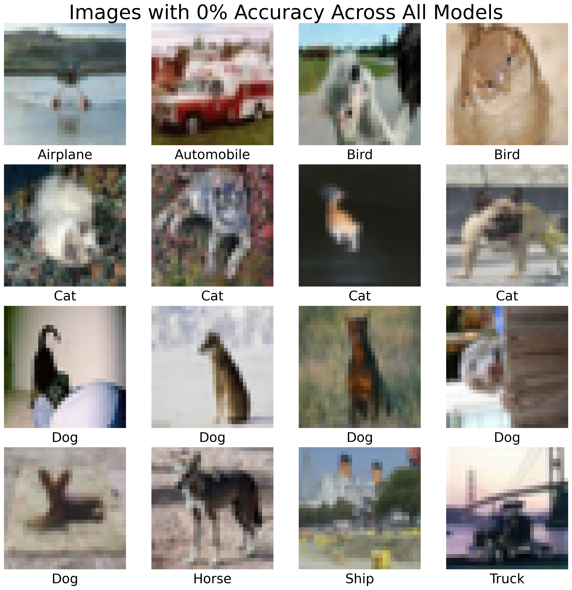

# Indistinguishable Insights 

This project extends the work presented in the paper ["Human Expertise in Algorithmic Prediction"](https://arxiv.org/abs/2402.00793). The paper discusses how algorithms, such as deep models trained via empirical risk minimization, have generally outperformed human experts in various domains. It proposes a framework for identifying regions within the input space where human experts are more likely to outperform the model and when an algorithm should "ask" a human expert to help. They demonstrate this framework on a medical binary classification task with expert human annotators (doctors) in their experiments. This project explores this framework in a multi-class classification setting with less reliable human annotators (mechanical turkers).

## Project Overview

This repository extends their experiments to a multi-class classification setting - the [CIFAR-10 dataset](https://www.cs.toronto.edu/~kriz/cifar.html). It lets $F$ (the feasible set of predictors) be a finite set of deep model architectures either trained from scratch or fine-tuned on the CIFAR-10 training set. It uses annotations from mechanical turkers on the test set of CIFAR-10 be the humans the framework can escalate to, in the regions where the model's predictions are less reliable or uncertain. I use the [CIFAR-10H dataset](https://github.com/jcpeterson/cifar-10h), which contains raw human annotations from mechanical turkers on the test set of CIFAR-10, to evaluate the framework. Each example in the test set is annotated by approximately 50 annotators. 

## Project details
1. Set up the environment and download the relevant data.
2. Infers with each model in the model zoo on the CIFAR-10 test set and saves the predictions. The vector of predictions for each example is our input space $X$ for the framework. See Appendix F of the paper for more details.
3. Clusters vectors of predictions (using KMedoids) to find approximate alpha indistinguishable subsets.
4. Examines model and human performance within each cluster. I try the Chebyshev distance metric proposed in the paper, in addition to Hamming distance, which I thought might be a better fit for the multi-class setting, but didn't yield any meaningful results. Identifies a cluster of examples where all models perform poorly, when compared to performance in other clusters.
5. Explores the types of mistakes made by each model within this cluster and finds a region where models have difficulty distinguishing between the "dog" and "cat" classes.
## Results
The framework functioned as outlined in the paper. The Chebyshev distance metric outperformed the Hamming distance metric, yielding subsets of the input space that more closely approached alpha indistinguishability based on the plots (see [results folder](results/)). With a small number of clusters, it's not clear that there is any subset of $X$ where requesting human help is meaningfully beneficial, except if you were using a ResNet (which is almost 10 years old!).

    

However, we can isolate a smaller but more interesting subset of the input space by increasing the number of clusters to 10. This reveals a cluster with around 2000 examples (roughly 20% of the test set) where all models perform poorly, when compared to performance in other clusters. All but one model (Swin Transformer) is outperformed by human annotators!

    

For all clustering plots, see [here](clustering_results/).

I explored further by analyzing the types of errors made by each model within this cluster. The heatmap below illustrates the proportion of errors for each model, broken down by the true class. Notably, all models make more mistakes on the 'dog' and 'cat' classes than any other classes (notice the dark horizontal bands for these classes). This pattern suggests a region where inputs are difficult to distinguish, and perhaps a region where none of the models we consider are trustworthy. I'm open to suggestions on how to further explore this result!

    

From this cluster, here are examples that none of the models predict correctly. The grid below shows the images and their true labels. Some of these ground truth labels are incorrect, e.g. the dog in row 2 that is labeled as a cat. Other images are very hard to distinguish, for example the airplane in the top left corner.

    

